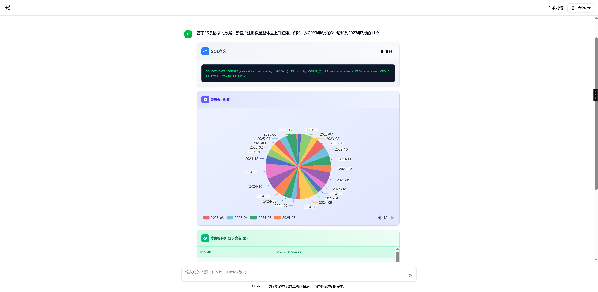
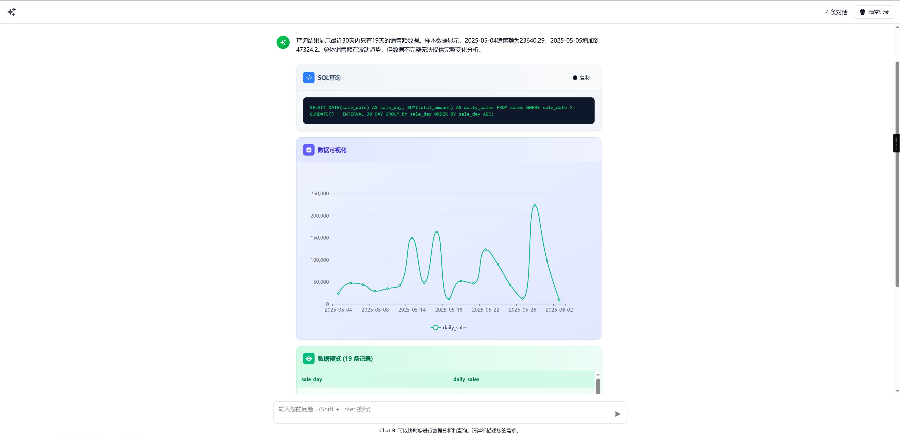

# Chat-BI

## ✨ Project Overview

Ask questions in plain language, and it automatically retrieves data from your database and creates charts like bar graphs and pie charts for you.

⭐ If this project helps you, please give me a Star!

## 🏗️ System Architecture

```
Frontend (React + TypeScript)
    ↓
Backend API (FastAPI + Python)
    ↓
┌─────────────────┬─────────────────┐
│  Business DB    │   System DB     │
│   (MySQL)       │   (MySQL)       │
└─────────────────┴─────────────────┘
    ↓
Vector Database (Milvus)
    ↓
AI Services (OpenAI)
```

### Workflow

1. Question vectorization: Convert user's natural language questions into vectors to find similar SQL query templates in the database.

2. Generate SQL queries: If no matching template is found, the system generates new SQL queries based on database structure and user questions.

3. Generate natural language answers: After executing SQL queries and retrieving data, the system converts structured data into easy-to-understand natural language responses.

4. Generate descriptions for new templates: The system saves newly generated SQL as templates and creates brief descriptions for future precise matching.

## 🛠️ Tech Stack

**Backend**: Python 3.10+ · FastAPI · SQLAlchemy · PyMilvus · OpenAI

**Frontend**: React 19 · TypeScript · Tailwind CSS · ECharts · Vite

**Storage**: MySQL · Milvus

## Demo Results

### 📊 Data Visualization

**Homepage**


**Pie Chart**: Monthly customer registration distribution


**Line Chart**: Sales trend analysis for the last 30 days


## 📦 Quick Start

### 🐳 Docker Deployment (Recommended)

#### 1. Clone Project

```bash
git clone https://github.com/sumingcheng/chat-bi.git
cd chat-bi
```

#### 2. Configure Environment Variables

Copy and edit the environment configuration file:

```bash
cp .env-temp .env
```

Edit the `.env` file and configure necessary parameters:

```env
# Debug mode
DEBUG=False

DB_HOST=mysql
DB_PORT=3306
DB_USER=root
DB_PASSWORD=admin123456
DB_NAME=chat_bi
DB_SYS_NAME=chat_bi_system


MILVUS_HOST=milvus-standalone
MILVUS_PORT=19530


OPENAI_API_KEY=sk-

EMBEDDING_API_URL=http://172.19.221.125:11434/api/embeddings
EMBEDDING_MODEL=bge-m3
```

#### 3. Start Services

```bash
# Execute in root directory and web directory
make build
# Return to root directory
make up
```

### 💻 Local Development

#### Backend Development

```bash
# Install dependencies
uv sync

# Start backend service
python main.py
```

```bash
 # Successful startup display
 ⚡ root@DESKTOP-AETE0Q9  /data/chat-bi   main  docker logs -f f341b3959a99
INFO:     Will watch for changes in these directories: ['/chat-bi']
INFO:     Uvicorn running on http://0.0.0.0:13000 (Press CTRL+C to quit)
INFO:     Started reloader process [1] using StatReload
INFO:     Started server process [8]
INFO:     Waiting for application startup.
2025-06-03 04:01:07 [INFO] app:57 - 🚀 Application starting...
2025-06-03 04:01:07 [INFO] app:58 - 📊 Checking database table status...
2025-06-03 04:01:07 [INFO] app:39 - ✓ Business database table 'category' exists
2025-06-03 04:01:07 [INFO] app:39 - ✓ Business database table 'customer' exists
2025-06-03 04:01:07 [INFO] app:39 - ✓ Business database table 'product' exists
2025-06-03 04:01:07 [INFO] app:39 - ✓ Business database table 'sales_order' exists
2025-06-03 04:01:07 [INFO] app:39 - ✓ Business database table 'order_item' exists
2025-06-03 04:01:07 [INFO] app:39 - ✓ Business database table 'sales' exists
2025-06-03 04:01:07 [INFO] app:49 - ✓ System database table 'sql_templates' exists
2025-06-03 04:01:07 [INFO] app:49 - ✓ System database table 'sql_template_params' exists
2025-06-03 04:01:07 [INFO] app:49 - ✓ System database table 'query_history' exists
2025-06-03 04:01:07 [INFO] app:63 - 📊 Initializing database tables...
2025-06-03 04:01:07 [INFO] app:68 - Initializing business database tables: ['category', 'customer', 'product', 'sales_order', 'order_item', 'sales']
2025-06-03 04:01:07 [INFO] app:71 - Business database table initialization completed
2025-06-03 04:01:07 [INFO] app:68 - Initializing system database tables: ['sql_templates', 'sql_template_params', 'query_history']
2025-06-03 04:01:07 [INFO] app:71 - System database table initialization completed
2025-06-03 04:01:07 [INFO] app:71 - ✅ Database table initialization completed
2025-06-03 04:01:07 [INFO] app:72 - 🎉 Chat-BI API started successfully!
INFO:     Application startup complete.
```

#### Frontend Development

```bash
cd web

# Install dependencies
pnpm install

# Start development server
pnpm run dev
```

## 🌐 Access URLs

After successful startup, you can access:

- **Frontend**: http://localhost:8888
- **Backend API Documentation**: http://localhost:13000/docs
- **Milvus Management Interface**: http://localhost:19000

## 🧪 Test Data

The project provides test data generation tools:

```bash
# Generate test data
python test/generate_test_data.py

# Run test queries
python test/run_test_data.py
```

## 🤝 Contributing

We welcome all forms of contributions!

- **Author**: [sumingcheng](https://github.com/sumingcheng)
- **Email**: Contact via GitHub Issues
- **Project Homepage**: https://github.com/sumingcheng/chat-bi
