# Chat-BI

🤖 **智能商业数据分析对话系统** - 使用自然语言查询数据，让数据分析变得简单直观！

## ✨ 项目特色

- 🗣️ **自然语言查询**：用普通话描述需求，自动生成SQL查询
- 📊 **智能可视化**：基于ECharts的动态图表展示，支持柱状图、折线图、饼图等多种类型
- 🧠 **AI驱动**：集成OpenAI API，提供智能SQL生成和自然语言解答
- 🔍 **向量搜索**：基于Milvus的相似查询模板匹配，提升响应速度
- 🛡️ **安全可靠**：SQL安全验证，防止危险操作
- 📱 **现代化UI**：基于React + TypeScript + Tailwind CSS的响应式界面

## 🏗️ 系统架构

```
Frontend (React + TypeScript)
    ↓
Backend API (FastAPI + Python)
    ↓
┌─────────────────┬─────────────────┐
│  Business DB    │   System DB     │
│   (MySQL)       │   (MySQL)       │
└─────────────────┴─────────────────┘
    ↓
Vector Database (Milvus)
    ↓
AI Services (OpenAI)
```



## 🛠️ 技术栈

**后端**：Python 3.10+ · FastAPI · SQLAlchemy · PyMilvus · OpenAI

**前端**：React 19 · TypeScript · Tailwind CSS · ECharts · Vite

**存储**：MySQL · Milvus

## 📦 快速开始

### 环境要求

- **Python 3.10+**
- **Node.js 18+**
- **MySQL 8.0+**
- **Milvus 2.3+**
- **OpenAI API Key**

### 🐳 Docker部署（推荐）

#### 1. 克隆项目
```bash
git clone https://github.com/sumingcheng/chat-bi.git
cd chat-bi
```

#### 2. 配置环境变量
复制并编辑环境配置文件：
```bash
cp .env-temp .env
```

编辑 `.env` 文件，配置必要参数：
```env
# 数据库配置
DB_HOST=mysql
DB_PORT=3306
DB_USER=root
DB_PASSWORD=admin123456
DB_NAME=chat_bi

# Milvus配置
MILVUS_HOST=milvus
MILVUS_PORT=19530

# OpenAI配置
OPENAI_API_KEY=your_openai_api_key_here
OPENAI_BASE_URL=https://api.openai.com/v1

# 代理配置（可选）
HTTP_PROXY=
HTTPS_PROXY=

# 向量化模型配置
EMBEDDING_API_URL=http://localhost:11434/api/embeddings
EMBEDDING_MODEL=nomic-embed-text
```

#### 3. 启动服务
```bash
# 启动基础服务（MySQL + Milvus）
docker-compose -f deploy/docker-compose-base.yaml up -d

# 启动应用服务
docker-compose -f deploy/docker-compose.yaml up -d
```

### 💻 本地开发

#### 后端开发
```bash
# 安装依赖
uv sync

# 启动后端服务
python main.py
```

#### 前端开发
```bash
cd web

# 安装依赖
npm install

# 启动开发服务器
npm run dev
```

## 🌐 访问地址

启动成功后，您可以访问：

- **Chat-BI主应用**：http://localhost:3000
- **后端API文档**：http://localhost:8000/docs
- **Milvus管理界面**：http://localhost:19000

## 🎯 功能特色

### 💬 智能对话查询
- **自然语言理解**：支持中文业务查询描述
- **查询示例**：内置10+常用业务查询模板
- **一键查询**：点击示例即可快速开始

### 📈 数据可视化
- **智能图表推荐**：根据数据特征自动选择合适的图表类型
- **多种图表支持**：柱状图、折线图、饼图、表格等
- **交互式图表**：支持缩放、筛选、导出等操作

### 🔍 模板学习
- **向量相似度匹配**：基于Milvus的语义搜索
- **自动模板生成**：成功查询自动保存为模板
- **参数智能提取**：AI辅助的查询参数解析

### 🛡️ 安全保障
- **SQL注入防护**：严格的SQL安全验证
- **只读查询**：仅允许SELECT操作
- **参数验证**：完整的输入参数校验

## 🧪 测试数据

项目提供了测试数据生成工具：

```bash
# 生成测试数据
python test/generate_test_data.py

# 运行测试查询
python test/run_test_data.py
```

## 运行效果

### 📊 数据可视化展示
**首页**
！[首页](images/index.png)

**饼图效果**：按月客户注册数量分布


**折线图效果**：最近30天销售额趋势分析


- 🎯 **智能查询**：支持自然语言描述，自动生成对应SQL
- 📈 **动态图表**：基于ECharts的交互式可视化展示
- 💡 **一键示例**：内置常用查询模板，快速上手体验

## 🤝 贡献指南

我们欢迎所有形式的贡献！

### 参与方式

1. **Fork 项目**：点击右上角 Fork 按钮
2. **创建分支**：`git checkout -b feature/your-feature`
3. **提交更改**：`git commit -am "Add your feature"`
4. **推送分支**：`git push origin feature/your-feature`
5. **提交PR**：创建 Pull Request

### 开发规范

- **代码规范**：遵循PEP 8（Python）和Prettier（TypeScript）
- **提交信息**：使用语义化提交格式
- **测试覆盖**：新功能需要对应的测试用例

## 🐛 问题反馈

遇到问题？欢迎通过以下方式反馈：

- **GitHub Issues**：[提交Issue](https://github.com/sumingcheng/chat-bi/issues)
- **功能建议**：[讨论区](https://github.com/sumingcheng/chat-bi/discussions)

## 📄 许可证

本项目采用 **Apache License 2.0** 许可证。详见 [LICENSE](LICENSE) 文件。

## 🙏 致谢

感谢以下优秀的开源项目：

- **[Milvus](https://milvus.io/)** - 高性能向量数据库
- **[FastAPI](https://fastapi.tiangolo.com/)** - 现代化Python Web框架  
- **[React](https://reactjs.org/)** - 用户界面构建库
- **[ECharts](https://echarts.apache.org/)** - 强大的数据可视化库
- **[Tailwind CSS](https://tailwindcss.com/)** - 实用优先的CSS框架

## 📞 联系方式

- **作者**：[sumingcheng](https://github.com/sumingcheng)
- **邮箱**：通过GitHub Issues联系
- **项目主页**：https://github.com/sumingcheng/chat-bi

---

⭐ 如果这个项目对您有帮助，请给我们一个Star！
