# Chat-BI

## 概述

用户使用自然语言查询数据。基于 **Python**、**MySQL** 和 **Milvus** 构建，将用户的问题转换为 SQL 查询，安全地执行，并产生符合`echarts`的数据可视化呈现结果。

## 架构图



## 本地开发

### 前提条件

- **Python 3.x**
- **MySQL** 数据库
- **Milvus** 向量数据库

### 安装步骤

#### 克隆仓库

```bash
git clone https://github.com/sumingcheng/chat-bi.git
cd chat-bi
```

#### 创建虚拟环境（可选，但推荐 conda）

```bash
python -m venv venv
source venv/bin/activate  # Windows 系统使用 `venv\Scripts\activate`
```

#### 安装依赖项

```bash
pip install torch==1.11.0+cpu -f https://download.pytorch.org/whl/torch_stable.html
pip install -r requirements.txt
```

#### 配置MySQL和Milvus

参考`deploy/docker-compose.yaml`的内容一键启动，注意提前修改环境变量
```yaml
      DB_HOST=mysql
      DB_PORT=3306
      DB_USER=root
      DB_PASSWORD=admin123456
      DB_NAME=chat_bi
      MILVUS_HOST=
      MILVUS_PORT=19530
      OPENAI_API_KEY=
      HTTP_PROXY=最好配置一下，要不然请求不到 openai
      HTTPS_PROXY=最好配置一下，要不然请求不到 openai
```

#### 运行应用程序

```
bash start.sh
```

## 应用地址

- `attu` ：http://127.0.0.1:19000
- `chat-bi`：http://127.0.0.1:13000

## 贡献指南

**Fork 仓库**：点击仓库页面右上角的 "Fork" 按钮。

**克隆您的 Fork**

```bash
git clone https://github.com/sumingcheng/chat-bi.git
cd chat-bi
```

**创建新分支**

```bash
git checkout -b feature/your-feature-name
```

**进行更改**：实现您的功能或修复。

**提交更改**

```bash
git commit -am "添加您的提交信息"
```

**推送到您的 Fork**

```bash
git push origin feature/your-feature-name
```

**提交 Pull Request**：前往原始仓库并提交 Pull Request。

## 许可证

本项目采用 **Apache License**。请参阅 [LICENSE](../LICENSE) 文件了解详情。

## 致谢

- **[Milvus](https://milvus.io/)**：用于相似度搜索的开源向量数据库。
- **[MySQL](https://www.mysql.com/)**：关系型数据库管理系统。
- **[Python](https://www.python.org/)**：开发所用的编程语言。
- **[Draw.io](https://www.draw.io/)**：用于创建架构图的工具。

## 联系方式

如有问题或建议，请提交 issue 或联系